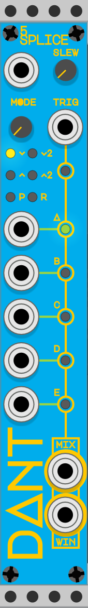

# 5Splice

* [Overview](#overview)
* [Basic Operation](#basic-operation)
* [Slew](#slew)
* [Modes](#modes)
* [Window Signal](#window-signal)
* [Polyphony](#polyphony)

## Overview

**4hp**

5Splice is a "window mixer" with up to 5 inputs, 6 different modes, an internal slew and a window signal output.

The components of the module are (top to bottom, left to right):

* Mode input
* Slew length knob
* Mode selection knob
* Trigger input
* Mode selection indicator lights [`v`, `v2`, `^`, `^2`, `P`, `R`]
* Trigger indicator light
* Channel A input
* Channel A windowed indicator light
* Channel B input
* Channel B windowed indicator light
* Channel C input
* Channel C windowed indicator light
* Channel D input
* Channel D windowed indicator light
* Channel E input
* Channel E windowed indicator light
* Mixer output
* Window signal output

## Basic Operation

Connect up to 5 signals to the channel inputs, connect a trigger signal to the trigger input.

The mixer output will be the currently windowed channel, as indicated by the indicator lights.

When the trigger input receives a trigger, the window will move on to the next connected input, according to the currently selected mode.

If there is not another connected input, or if the mode causes the next channel selection to be the same, the window will remain on the current channel.

## Slew

The slew knob can have a value from `0` to `44,100` samples, the default is `441` samples. When the VCVRack sample rate is set at `44.1` kHz this equates to a `1` millisecond slew. `0` will disable the slew.

When the window shifts between channels, if the slew is active, the mixed output signal will be an interpolated value between the previously selected channel and the newly selected channel, over the length of the slew.

For audio signals, a short slew will prevent audible clicks when the window shifts, a long slew will cause a cross-fade between the two channels.

For CV signals the slew can be used in the same way, as a glide between pitch CV values, for example.

## Modes

The mode knob can have a value from `0` to `6`, where each integer represents the following modes:

* `0` = `v` **Forwards** (eg: `A` > `B` > `C` > `D` > `E` > `A`)
* `1` = `v2` **Forwards by 2** (eg: `A` > `C` > `E` > `B` > `D` > `A`)
* `2` = `^` **Backwards** (eg: `A` > `E` > `D` > `C` > `B` > `A`)
* `3` = `^2` **Backwards by 2** (eg: `A` > `D` > `B` > `E` > `C` > `A`)
* `4` = `P` **Ping-Pong** (eg: `A` > `B` > `C` > `D` > `E` > `D` > `C` > `B` > `A`)
* `5 & 6` = `R` **Random** picks a new channel from the connected inputs, excluding the current channel

The mode CV input is normalled to `0` volts and its value is added to the mode knob value. This means a standard `+-5` volt CV signal can modulate the currently selected mode.

## Window signal

The window signal output will provide a value between `0` and `10` volts based on the currently selected channel as follows:

* Channel A = `0` volts
* Channel B = `2.5` volts
* Channel C = `5` volts
* Channel D = `7.5` volts
* Channel E = `10` volts

## Polyphony

This module is not currently compatible with VCV Rack's Polyphonic cables. If you would like polyphonic support, you can let me know via an [issue](https://github.com/Miff-Real/DanTModules-Manual/issues), via the [VCV Rack Community](https://community.vcvrack.com/t/dantmodules-v1-0-2-update-context-menu-options-for-wavulike-bug-fix-v1-0-3/11885), or via my [Instagram](https://www.instagram.com/dant.synth/).
