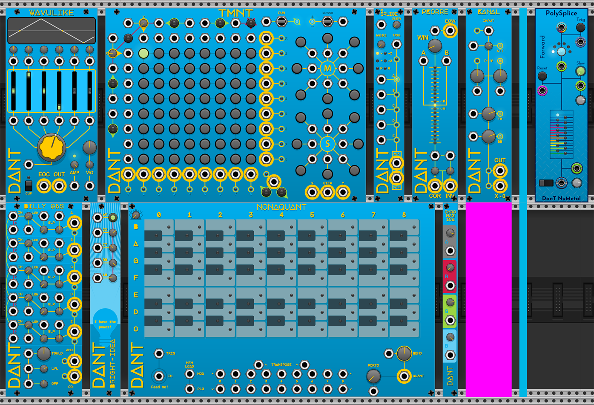

# DanTModules v2.4.1

* [Overview](#overview)
* [Tips & Donations Welcome](#tips--donations-welcome)
* [Nu Metal](#nu-metal)
  * [Nu-Modules](#nu-modules)
    * [PolySplice](#polysplice)
* [Modules](#modules)
  * [WAVULIKE](#wavulike)
  * [TMNT](#tmnt)
  * [5Splice](#5splice)
  * [pKorre](#pkorre)
  * [Kanal](#kanal)
  * [Billy G8s](#billy-g8s)
  * [Bright Idea](#bright-idea)
  * [Nonaquant](#nonaquant)
  * [Chromagica](#chromagica)
  * [Chromakey](#chromakey)
* [Common Controls & Concepts](#common-controls--concepts)
  * [Global Plugin Settings](#global-plugin-settings)
  * [Themes](#themes)
  * [CV Param Mode](#cv-param-mode)
  * [CV Input Slew](#cv-input-slew)
  * [Clamp CV Values](#clamp-cv-values)

## Overview

This [plugin](https://library.vcvrack.com/DanTModules/) contains free modules for VCV Rack 2 developed by [DanT](https://www.youtube.com/@MiffReal).

If you encounter any bugs or issues with this plugin or its modules, please raise an [issue](https://github.com/Miff-Real/DanTModules-Manual/issues) in this GitHub repository, or you can ask about a specific module or issues in the [community forums](https://community.vcvrack.com/c/plugins/6).

I develop this plugin in my spare time, unfortunately this means that this manual is a constant work-in-progress, and will probably never receive the input it deserves. If you would like to contribute to this manual in any way, please do send me a [pull-request](https://www.digitalocean.com/community/tutorials/how-to-create-a-pull-request-on-github), open an [issue](https://github.com/Miff-Real/DanTModules-Manual/issues) with your contribution, or [get in touch via the VCV community forums](https://community.vcvrack.com/u/dan.tilley/summary).

I would love to see anything you create with this plugin, tag your creations with `#dantmodules` & the name of the modules used.

## Tips & Donations Welcome

**If you feel generous or want to motivate me to further develop this plugin, you may [donate here](https://monzo.me/danieltilley2).**

## Nu Metal

As of DanTModules `v2.4.0` there will be a new design philosophy implemented, based upon the experience and lessons learned from the original 10 modules of the plugin.

This new philosophy and modules will be called `NuMetal` and they are documented separately [NuMetal-Modules](nu-metal.md)

### Nu-Modules

#### [PolySplice](nu-metal.md#polysplice)

## Modules

#### [WAVULIKE](wavulike.md)
#### [TMNT](tmnt.md)
#### [5Splice](5splice.md)
#### [pKorre](pkorre.md)
#### [Kanal](kanal.md)
#### [Billy G8s](billyg8s.md)
#### [Bright Idea](brightidea.md)
#### [Nonaquant](nonaquant.md)
#### [Chromagica](chromagica.md)
#### [Chromakey](chromakey.md)

## Common Controls & Concepts

### Global Plugin Settings

Some modules in the plugin have the ability to save a setting as default, this will determine its value when adding the module to a patch in future

Settings like this will be saved to a `Rack2\DanTModules.json` file

You can edit this file directly to change the default settings, though do ensure the edits are valid JSON

You can also delete the file to reset the plugin defaults

### Themes

All modules in the plugin (except Chromakey) have a right-click context menu option where the module and plugin default theme can be selected

The plugin default theme is saved to `DanTModules.json` under the key of `defaultTheme` with a value of `0` to `2`

#### Objectively Blue

This is the original and default yellow on blue theme of the plugin

This themes settings value is `0`

#### Superficially Deep

This is an alternative darker theme of orange on navy

This themes settings value is `1`

#### Magical CV

This is a special theme of black on custom colour panels, where the panel colour is controlled by the [Chromagica](chromagica.md) module

This themes settings value is `2`

### CV Param Mode

The CV Param Mode controls how a CV signal input interacts with the related Parameter

It has 3 different modes:

#### Offset

The CV signal is simply added to the current parameter value

#### Follow

The parameter value will be directly set to the CV signal value, causing the control to move autonomously, also meaning that the control cannot be changed by the user while the CV input is connected

#### Attenuate

The CV signal input will be attenuated by the current parameter value

If the parameter is bi-polar then the value can be attenuverted

### CV Input Slew

This option allows a module to apply a slew to all of its CV inputs and can be used to prevent audio artifacts caused by abrupt changes in parameter values

A slew value of `None` will disable this option, otherwise the slew length is set in milliseconds, from `1` to `100`

### Clamp CV Values

Depending on the [CV Param Mode](#cv-param-mode), the resulting value may fall outside the range of the parameter

When this option is enabled, this value will be clamped to the parameter range

Disabling this option will allow values to exceed their parameter ranges
