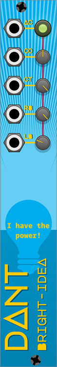

# Bright Idea

* [Overview](#overview)
* [Basic Operation](#basic-operation)
* [Context Menu Options](#context-menu-options)

## Overview

**4hp**

Bright Idea is a module to CV control the Cable Opacity & Tension, Room Brightness, and Light Bloom of VCV Rack.

## Basic Operation

When the module is added to the patch, the parameters will sync up to the current VCV Rack settings

Tweaking the knobs will now directly change the settings

* `AC` = Active (Pressing the button will deactivate the module)
* `CO` = Cable Opacity
* `CT` = Cable Tension
* `RB` = Room Brightness
* `LB` = Light Bloom

The CV input for `AC` will toggle the active state on triggers `> 0 volts`

All the other CV inputs works as per the typical plugin **Param Behaviour** & **CV Input Slew** options, see [WAVULIKE#module-options](wavulike.md#module-options)

Only one instance of the module can control the VCV Rack settings, if other instances are added to a patch they will become **Zombified** as indicated by the dynamic text on the light-bulb, which also indicates when the module is inactive

## Context Menu Options

*  **Override Rack** off by default - Controls the values when the module is added to the patch, activated, or when the module is un-bypassed. When this is off, the module will set it’s parameter values to match the current Rack settings, ignoring any changes to the parameters that may have been made while the module was not active. When this is on the current module parameter values will be used, ignoring any changes to the Rack settings that may have been made while the module was not active or bypassed.

*  **Deactivation Defaults** on by default - Controls the values when the module is deactivated or bypassed. When this is on the Rack default settings will be restored when the module becomes inactive. When off the values of the parameters will not change. Rack default settings are: `float cableOpacity = 0.5; float cableTension = 1.0; float rackBrightness = 1.0; float haloBrightness = 0.25;`

*  **Module Browser Deactivation** on by default - This option will temporarily deactivate the module while the module browser is open. Note, this is independent of the Active Toggle button & CV.

### Option Interactions

These 3 context menu options control how the module acts when it’s state changes, and they interact with each other:

* you have a patch **without** Bright-Idea
  * The Rack settings apply, you can change them from the View menu, the values are saved into the `settings.json` file, they are not saved in the patch file
  * If you load any patch that does not include an active Bright-Idea module, the Rack settings will remain the same
* you **add** the Bright-Idea module to the patch
  * the module is active by default but the option Override Rack is OFF by default, so when you add the module to the patch, the module will set it’s parameters to the Rack settings, then take control of the settings
  * you can no longer change the values from the View menu because the module is controlling them, you can change them directly on the module using the knobs, or via CV
  * the module parameters and its state (active or deactivated) will be saved in the patch file, so if you load any patch with an active Bright-Idea module, it will immediately change the values
* you **deactivate** the module by clicking the Active Toggle button (or toggle the button with a CV trigger)
  * By default, the Deactivation Defaults option is ON, this means when you click the button and the module becomes deactivated (the button is unlit), the Rack default settings will be applied. The module will no longer control the settings, if you want to change the settings you can do so via the View menu, you can still change the knobs on the module but this will not affect the values
  * This is also true if you right-click and bypass the module, but note that this is independent of the Active Toggle button, if the module is deactivated when you bypass the module, it will remain deactivated when you un-bypass the module
* you **activate** the module by clicking the Active Toggle button (or toggle the button with a CV trigger)
  * By default, the Override Rack option is OFF, this means that when you reactivate the module, it will set it’s parameters to the current Rack settings, which will be the default settings if you have not turned OFF the Deactivation Defaults option, or not modified the values via the View menu while the module was deactivated. So effectively you will see no change
  * If the Override Rack option is turned ON, this means that the values of the module parameters will be set as the Rack settings
* you open the **module browser**
  * The Module Browser Deactivation option is ON by default, which means that the module will be deactivated when the module browser is open. However, if you have also turned OFF the Deactivation Defaults option, when the module is deactivated, the values will not be changed from what the module parameters are at the instant of deactivation (you might be modulating the parameters with CV). So potentially, if the Room Brightness was low, it would remain low in the module browser
