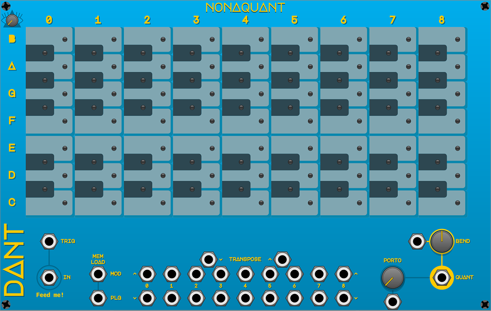

# Nonaquant

* [Overview](#overview)
* [Basic Operation](#basic-operation)

## Overview

**40hp**

Nonaquant is a 16 channel polyphonic 9 octave quantizer

## Basic Operation

Send (1 to 16 channels) CV signals to the `IN` input and get `1volt/octave` quantized CV signals back from the `QUANT` output

If the `TRIG` input is connected, the quantized note will only change on `> 0 volts` triggers

The number of channels connected is displayed by the dynamic text below the `IN` input

The All Seeing Eye knob at the top left controls which channel is visualized by the lights and knobs

Click the keys to activate the desired notes, the notes selected apply to all channels

When the `BEND` and `PORTO` inputs are NOT connected, the knob controls this parameter and applies it to all channels, when the inputs are connected, each channel takes its value directly from the CV signal overriding the knob value

`BEND` will add or subtract semitones to the quantized note, you can use an envelope, for example, to create a bend effect

`PORTO` will introduce a slew to note changes up to `1 second` long

The `TRANSPOSE` inputs are all monophonic and activate on `> 0 volts` triggers

The global `TRANSPOSE` will move all notes up or down, notes can move from one octave to the next

The individual octave `TRANSPOSE` will move only the notes in that octave, notes that are moved past the top or bottom of the octave, will be lost
