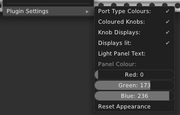
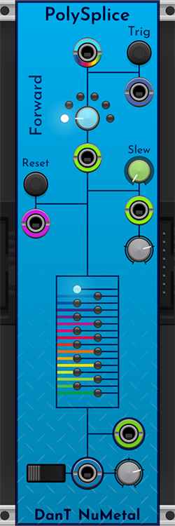

# DanTModules v2.4.0 - Nu Metal modules

* [Common Controls & Concepts](#common-controls--concepts)
* [PolySplice](#polysplice)

## Common Controls & Concepts

### Plugin settings

Nu Metal modules have their own plugin settings, which are saved to the file `DanTNuMetal.json`.

* `Port Type Colours` will toggle the port type colours
  * inputs are slightly brighter than outputs
  * multi purpose ports match the panel colour 
  * red = audio 
  * yellow = volt per octave 
  * magenta = reset 
  * aqua = clock 
  * blue = trigger 
  * dark blue = gate 
  * green = modulation 
  * rainbow = polyphonic
* `Coloured Knobs` will toggle knob type colours
  * DanT blue = general knobs 
  * green = uni or bi polar knobs 
  * grey = attenuvertor knobs 
* `Knob Displays` will toggle the knob value and CV display
  * unipolar knobs have a green value arc and a yellow CV arc (if CV control is offered) 
  * bipolar knobs have a positive green and negative red arc, with a yellow CV arc (if CV control is offered)
  * attenuvertor knobs have a dark arc with notches for values of `-2`, `-1`, `0`, `1`, `2` (where offered)
* `Displays Lit` will toggle the knob display being full brightness
* `Light Panel Text` will toggle between dark and light panel elements
* `Panel Colour` allows you to set a custom colour for the panels
* `Reset Appearance` resets all the above settings to their default values

## PolySplice

**7hp**

PolySplice is a polyphonic version of the original [5Splice](5splice.md) module, a "window mixer" with up to 16 inputs, 6 different modes, an internal slew, a window signal output and polyphonic output modes.

### Controls

From top-left to bottom-right:

* Polyphonic input
* Trigger button
* Trigger input
* Mode knob
* Mode CV input
* Slew knob
* Reset button
* Slew CV input
* Reset trigger input
* Slew CV attenuvertor
* Channel LEDs
* Window output
* Polyphonic mode switch
* Signal output
* Output attenuvertor

### Basic operation

* You need at minimum two channels to get useful outputs.
* Each channel with a signal is represented by one of the LEDs, the LEDs for channels without a signal will be off. The selected channel LED will be lit brightly.
* On each trigger a new channel will be selected to be the output based upon the current mode:
  * **Forwards**
  * **Forwards by 2**
  * **Backwards**
  * **Backwards by 2**
  * **Ping-Pong**
  * **Random**
* When the selected channel is changed, the slew will be applied between the previous and next channel values.
* On any reset trigger, channel `1` will be selected and any current slew will be interrupted.
* The window output will be `0.5 volts` per channel, e.g. if channel `3` is selected, the window output will be `1.5 volts`, if channel `16` is selected, the window output will be `8 volts`.
* The output will be the selected channels value affected by the output attenuvertor.
* There are two extra polyphonic modes:
  * `Inputs incremental` the number of channels output will match the number of input channels. Channel `1` will be the selected channel, subsequent channels will have the value of the next channel, and wrap back to channel `1`.
  * `All normalled` all 16 channels will output the currently selected channel value affected by the output attenuvertor.
