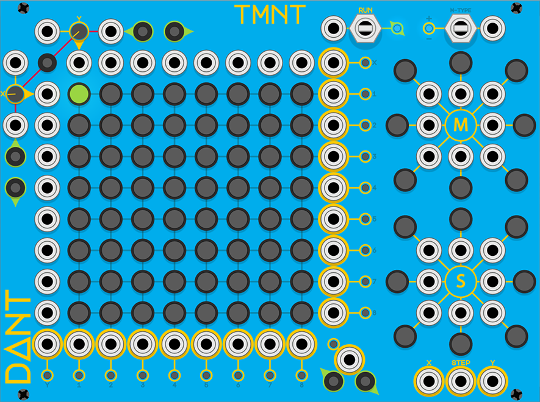
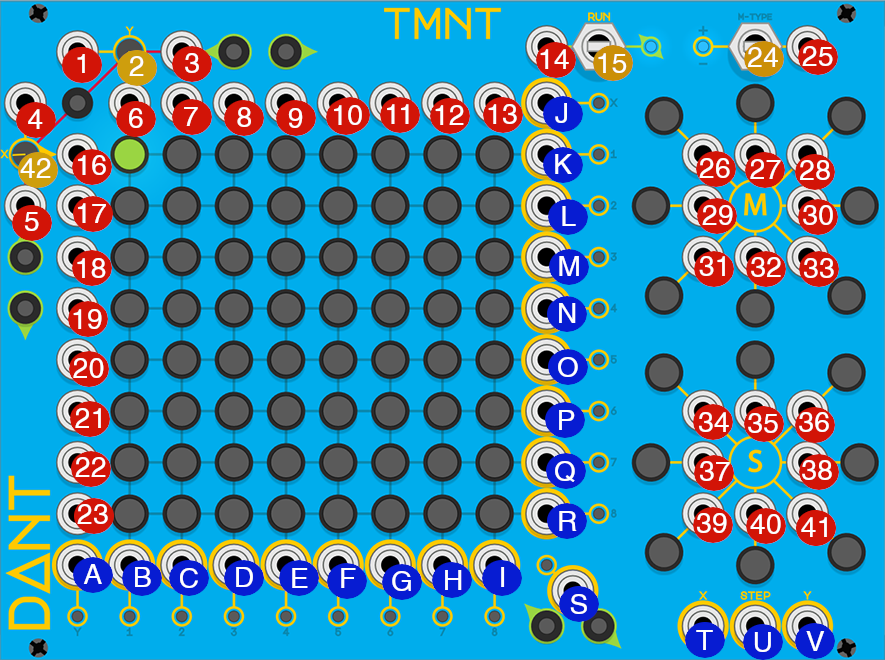

# TMNT

* [Alt TMNT documentation PDF](tmnt.pdf) generously created by the most excellent [Worker 13](https://community.vcvrack.com/u/worker_13/summary)

* [Overview](#overview)
* [Basic Operation](#basic-operation)
* [Run Modes](#run-modes)
* [BPMs & Resets](#bpms--resets)
* [Manual Steps](#manual-steps)
* [Enabling Steps](#enabling-steps)
* [Mutating Steps](#mutating-steps)
* [Shifting Steps](#shifting-steps)
* [Step Values](#step-values)
* [Polyphony](#polyphony)
* [Appendix](#appendix)
  * [Annotated image](#annotated-image)

## Overview

**34hp**

TMNT is a contrived acronym for "Timed Mutating Non-Linear Triggers", which is meant to describe the focus of this module as type of sequencer.

The components of the module are (left to right, top to bottom):

* Column (Y) BPM input
* Column (Y) BPM control knob
* Column (Y) reset input
* Row (X) manual step backwards button
* Row (X) manual step forwards button
* Run input
* Run control switch
* Run indicator light
* Mutate type indicator light
* Mutate type control switch
* Mutate type input
*
* Row (X) BPM input
* Manual reset button & reset indicator light
* Column (Y) step activation inputs 1-8
* Row (X) BPM trigger output
* Row (X) BPM indicator light
* Mutate buttons for NW, N & NE directions
*
* Row (X) BPM control knob
* Row (X) step activation input 1
* Step activation buttons 1-8
* Row (X) active step output 1
* Row (X) active step indicator light 1
* Mutate inputs for NW, N & NE directions
*
* Row (X) reset input
* Row (X) step activation input 2
* Step activation buttons 9-16
* Row (X) active step output 2
* Row (X) active step indicator light 2
* Mutate button for W direction
* Mutate input for W direction
* Mutate input for E direction
* Mutate button for E direction
*
* Column (Y) manual step backwards button
* Row (X) step activation input 3
* Step activation buttons 17-24
* Row (X) active step output 3
* Row (X) active step indicator light 3
* Mutate inputs for SW, S & SE directions
*
* Column (Y) manual step forwards button
* Row (X) step activation input 4
* Step activation buttons 25-32
* Row (X) active step output 4
* Row (X) active step indicator light 4
* Mutate buttons for SW, S & SE directions
*
* Row (X) step activation input 5
* Step activation buttons 33-40
* Row (X) active step output 5
* Row (X) active step indicator light 5
* Shift buttons for NW, N & NE directions
*
* Row (X) step activation input 6
* Step activation buttons 41-48
* Row (X) active step output 6
* Row (X) active step indicator light 6
* Shift inputs for NW, N & NE directions
*
* Row (X) step activation input 7
* Step activation buttons 49-56
* Row (X) active step output 7
* Row (X) active step indicator light 7
* Shift button for W direction
* Shift input for W direction
* Shift input for E direction
* Shift button for E direction
*
* Row (X) step activation input 8
* Step activation buttons 57-64
* Row (X) active step output 8
* Row (X) active step indicator light 8
* Shift inputs for SW, S & SE directions
*
* Column (Y) BPM trigger output
* Column (Y) active step outputs 1-8
* Active step indicator light
* Shift buttons for SW, S & SE directions
*
* Active step output
*
* Column (Y) BPM indicator light
* Column (Y) active step indicator lights 1-8
* X&Y manual step backwards button
* X&Y manual step forwards button
* X value output
* Step value output
* Y value output

## Basic Operation

There are three types of outputs on this module; BMP triggers, Step triggers, and Step values. Typically, the BPM triggers would be used to clock other modules, the Step values might be used as either pitch or modulation sources, but the main focus would be using the Step triggers as a generative rhythm. But of course, there are no rules, you can use the outputs in any way you please.

The grid that consists of 64 steps is broken down into 8 rows and 8 columns, each with 8 steps. The currently active step will be lit green, enabled steps will be lit yellow, disabled steps will be dark. When in a run mode, the X-BPM controls the speed at which the active step advances horizontally, and the Y-BPM controls the speed at which the active step advances vertically.

When the active step advances horizontally, if the newly activated step is enabled, its corresponding Column (Y) will fire a trigger.

When the active step advances vertically, if the newly activated step is enabled, its corresponding Row (X) will fire a trigger.

When any Row (X) or Column (Y) step trigger fires, the Active Step output will also fire.

## Run Modes

There are 3 run modes that can be selected using the Run control switch:
* **Stopped** (Centered, Blue indicator, `0`)
* **Forwards** (Down, Green indicator, `1`)
* **Backwards** (Up, Red indicator, `-1`)

A non-zero signal `S` given to the Run input will override the Run mode currently selected by the control switch as follows:
* `S < -1 volt` Backwards
* `-1 volt >= S <= 1 volt` Stopped
* `S > 1 volt` Forwards

An unconnected Run input or `0 volt` signal will have no effect on the current Run mode.

## BPMs & Resets [Demo Video](https://www.instagram.com/p/COdr_WIBtiH/)

The X & Y BPM value is determined by the control knob value, plus the input signal multiplied by `100`, but note that both values are truncated to integers first and the input is normalled to `0` volts.
* **For example**: X BPM knob value set to `355.5`
* X BPM input receives a signal of `-2.3` volts.
* The resultant BPM would be `355 + -230 = 125`BPM

The knob value itself is limited to between `0` and `1000` BPM, however the calculated result is not.

An interesting consequence of this calculation is that using a `+10` volt signal you could create `2000`BPM, or using a low knob value with a negative signal you could create a negative BPM. In fact, using a module like [NYSTHI Fixed Voltage Source](https://library.vcvrack.com/NYSTHI/FixedVoltageSource) you can create crazy value BPMs.

A temporarily negative BPM can be used to create a pause in the generated rhythm. While the BPM is negative, the inter-trigger time accumulates, when the BPM returns to positive, that accumulated inter-trigger time must be played out before the next trigger will be fired.

In addition to the BPM inputs, both X & Y have a reset input and there is a reset button with an indicator light. Pressing the button will reset both X & Y, so the active step will become 1, and the indicator light will flash red. The reset inputs will fire for any positive value `> 0`, the X reset will set the active step to be in column 1, the Y reset will set the active step to be in row 1. The indicator light will flash yellow for an X reset, purple for a Y reset, and white for X & Y simultaneous.

Note that when a reset is fired, if the target step is enabled this will fire a new trigger, even if the step number does not change.

## Manual Steps [Demo Video](https://www.instagram.com/p/COh97SBh0LV/)

There are six buttons that can be used to manually advance the active step, X forwards (right) & backwards (left), Y forwards (down) & backwards (up), and X & Y combined forwards (right & down) & backwards (left & up).

Note that manual steps will also fire the BPM trigger outputs & the steps will respect the current Mutate & Shift setting.

## Enabling Steps [Demo Video](https://www.instagram.com/p/COghFfhh_Yt/)

Each of the 64 steps is a button, clicking the button will toggle the step between enabled (yellow) and disabled (dark).

You can automatically toggle a step by sending CV signals to the 16 step activation inputs. Each step corresponds to two inputs, one X and one Y. If both inputs for a step receive a `> 0` signal simultaneously, the step will be toggled.

## Mutating Steps [Demo Video](https://www.instagram.com/p/COkuOtDBfi5/)

At the top-right of the module are the Mutate controls. The Mutate Type control switch has 3 modes:
* **Toggle** (Centered, Blue indicator, `2`) Enabled mutation directions will toggle the adjacent steps.
* **Remove** (Down, Red indicator, `1`) Enabled mutation directions will disable the adjacent steps.
* **Insert** (Up, Green indicator, `3`) Enabled mutation directions will enable the adjacent steps.

A non-zero signal `S` given to the Mutate Type input will override the Mutate mode currently selected by the control switch as follows:
* `S < -2.5 volts` Remove
* `-2.5 volts >= S <= 2.5 volts` Toggle
* `S > 2.5 volts` Insert

An unconnected Mutate Type input or `0 volt` signal will have no effect on the current Mutate mode.

Each of the 8 cardinal directions (North, North-East, East, South-East, South, South-West, West, North-West) has a button and an input. Clicking the button will toggle that mutation direction between enabled (red) and disabled (dark). Any signal `> 0` sent to an input will enable that mutation direction. So, for example, you could use an LFO to toggle a mutation direction on and off.

Any enabled mutation directions will take effect whenever the active step advances (either due to X or Y BPM or a manual step). The 8 adjacent steps to the newly active step will have their state altered by the enabled mutation directions. Adjacency wraps at the edge of the grid, so for example, when step 1 becomes active, an enabled North mutation would act upon step 57.

## Shifting Steps

Below the mutation section are the Shift controls, these work in a very similar fashion. The 8 cardinal directions have buttons and inputs that work exactly the same but with enabled shift directions being yellow.

Any enabled shift direction will take effect as the active step advances (either due to X or Y BPM or a manual step). For any enabled shift direction, when the next active step is evaluated, it will be moved one step in that direction. All directions will be evaluated before being applied, therefore enabling, for example, both North and South shift directions will result in no shift.

## Step Values

These 3 outputs have their values set by the currently active step.

The X & Y step value outputs will range from `1.25 volts` to `10 volts` depending on the active steps row and column number. So for example when the active step is 23 (column = 7, row = 3), the X step value output will be `8.75 volts` and the Y step value output will be `3.75 volts`.

The step value output will range from `0.15625 volts` to `10  volts` depending on the active step number. So for example when the active step is 63, the step value output will be `9.844 volts`.

## Polyphony

This module is not currently compatible with VCV Rack's Polyphonic cables. If you would like polyphonic support, you can let me know via an [issue](https://github.com/Miff-Real/DanTModules-Manual/issues), via the [VCV Rack Community](https://community.vcvrack.com/t/dantmodules-v1-0-2-update-context-menu-options-for-wavulike-bug-fix-v1-0-3/11885), or via my [Instagram](https://www.instagram.com/dant.synth/).

## Appendix
### Annotated image

Image provided by [@rsmus7](https://community.vcvrack.com/u/rsmus7)

**Inputs & Controls**

1. 🔴 **Y BPM input** - provide a CV signal to modulate the speed at which the active step moves vertically

2. 🟡 **Y BPM knob** - sets the speed at which the active step moves vertically, from `0` (static) to `1000` BPM (fast)

3. 🔴 **Y Reset input** - provide a CV signal that will be processed as a trigger (a trigger will fire when the signal moves from `0` to `1`) The trigger will reset the active step to Row 1 (the top row) and the reset LED will flash purple

4. 🔴 **X BPM input** - provide a CV signal to modulate the speed at which the active step moves horizontally

5. 🔴 **X Reset input** - provide a CV signal that will be processed as a trigger (a trigger will fire when the signal moves from `0` to `1`) The trigger will reset the active step to column 1 (the left column) and the reset LED will flash yellow

6. 🔴 **Column 1 step activation input** - provide a CV signal above `0` to activate this column, this signal combined with any currently active row will trigger the corresponding step to toggle its enabled state (enabled becomes disabled, and vice versa)

7. 🔴 **Column 2 step activation input**

8. 🔴 **Column 3 step activation input**

9. 🔴 **Column 4 step activation input**

10. 🔴 **Column 5 step activation input**

11. 🔴 **Column 6 step activation input**

12. 🔴 **Column 7 step activation input**

13. 🔴 **Column 8 step activation input**

14. 🔴 **Run direction input** - provide a CV signal to modulate the run direction, a `0` signal has no effect, lower than `-1` sets backwards, higher than `1` sets forwards, between `-1` and `1` (excluding `0`) sets stopped

15. 🟡 **Run direction switch** - sets the direction the active step moves in, stopped means the active step does not move, backwards means the active steps moves upwards and leftwards, forwards means the active step moves downwards and rightwards

16. 🔴 **Row 1 step activation input** - provide a CV signal above `0` to activate this row, this signal combined with any currently active column will trigger the corresponding step to toggle its enabled state (enabled becomes disabled, and vice versa)

17. 🔴 **Row 2 step activation input**

18. 🔴 **Row 3 step activation input**

19. 🔴 **Row 4 step activation input**

20. 🔴 **Row 5 step activation input**

21. 🔴 **Row 6 step activation input**

22. 🔴 **Row 7 step activation input**

23. 🔴 **Row 8 step activation input**

24. 🟡 **Mutation Type switch** - sets the way that steps are mutated when the mutation direction is enabled, insert (up) sets the step to enabled, toggle (middle) flips the step state, remove (down) disables the step

25. 🔴 **Mutation Type input** - provide a CV signal to modulate the mutation type, a `0` signal has no effect, lower than `-2.5` sets remove, higher than `2.5` sets insert, between `-2.5` and `2.5` (excluding `0`) sets toggle

26. 🔴 **NW Mutation Direction input** - provide a CV signal to modulate this mutation directions state, any signal higher than `0` will enable this direction

27. 🔴 **N Mutation Direction input**

28. 🔴 **NE Mutation Direction input**

29. 🔴 **W Mutation Direction input**

30. 🔴 **E Mutation Direction input**

31. 🔴 **SW Mutation Direction input**

32. 🔴 **S Mutation Direction input**

33. 🔴 **SE Mutation Direction input**

34. 🔴 **NW Shift Direction input** - provide a CV signal to modulate this shift directions state, any signal higher than `0` will enable this direction

35. 🔴 **N Shift Direction input**

36. 🔴 **NE Shift Direction input**

37. 🔴 **W Shift Direction input**

38. 🔴 **E Shift Direction input**

39. 🔴 **SW Shift Direction input**

40. 🔴 **S Shift Direction input**

41. 🔴 **SE Shift Direction input**

42. 🟡 **X BPM knob** - sets the speed at which the active step moves horizontally, from `0` (static) to `1000` BPM (fast)

**Outputs**

  A. 🔵 **Y BPM output** - outputs a trigger at the current Y BPM value

  B. 🔵 **Column 1 output** - outputs a trigger when the active steps moves horizontally and lands on an enabled step in column `1`

  C. 🔵 **Column 2 output** - outputs a trigger when the active steps moves horizontally and lands on an enabled step in column `2`

  D. 🔵 **Column 3 output** - outputs a trigger when the active steps moves horizontally and lands on an enabled step in column `3`

  E. 🔵 **Column 4 output** - outputs a trigger when the active steps moves horizontally and lands on an enabled step in column `4`

  F. 🔵 **Column 5 output** - outputs a trigger when the active steps moves horizontally and lands on an enabled step in column `5`

  G. 🔵 **Column 6 output** - outputs a trigger when the active steps moves horizontally and lands on an enabled step in column `6`

  H. 🔵 **Column 7 output** - outputs a trigger when the active steps moves horizontally and lands on an enabled step in column `7`

  I. 🔵 **Column 8 output** - outputs a trigger when the active steps moves horizontally and lands on an enabled step in column `8`

  J. 🔵 **X BPM output** - outputs a trigger at the current X BPM value

  K. 🔵 **Row 1 output** - outputs a trigger when the active steps moves vertically and lands on an enabled step in row `1`

  L. 🔵 **Row 2 output** - outputs a trigger when the active steps moves vertically and lands on an enabled step in row `2`

  M. 🔵 **Row 3 output** - outputs a trigger when the active steps moves vertically and lands on an enabled step in row `3`

  N. 🔵 **Row 4 output** - outputs a trigger when the active steps moves vertically and lands on an enabled step in row `4`

  O. 🔵 **Row 5 output** - outputs a trigger when the active steps moves vertically and lands on an enabled step in row `5`

  P. 🔵 **Row 6 output** - outputs a trigger when the active steps moves vertically and lands on an enabled step in row `6`

  Q. 🔵 **Row 7 output** - outputs a trigger when the active steps moves vertically and lands on an enabled step in row `7`

  R. 🔵 **Row 8 output** - outputs a trigger when the active steps moves vertically and lands on an enabled step in row `8`

  S. 🔵 **Active step output** - outputs a trigger when the active step lands on any enabled step

  T. 🔵 **X value output** - outputs a CV signal based on which column the active step currently occupies

  U. 🔵 **Step value output** - outputs a CV signal based on the absolute step number of the active step (steps are numbered from `1` to `64` where step `1` is top left and step `64` is bottom right)

  V. 🔵 **Y value output** - outputs a CV signal based on which row the active step currently occupies
