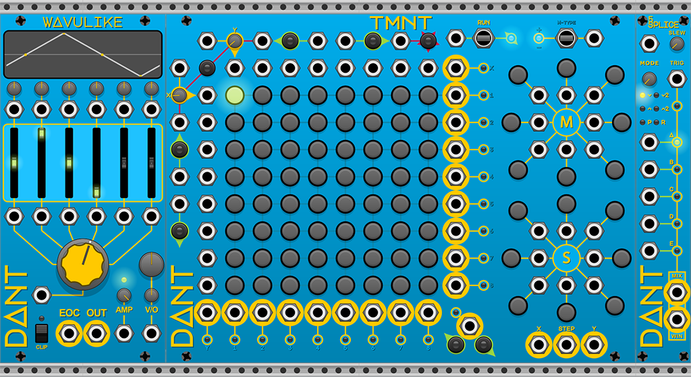

# DanTModules v2.3.4 Preview Builds

## Overview

In the run up to the [VCV Rack 2 release](https://community.vcvrack.com/t/rack-development-blog/5864/70?u=dan.tilley) I will be trying my best to get the DanTModules plugin upgraded.

As that work progresses I will post Windows builds here for any prospective users to test (at their own risk blah blah blah...)

## Note
* Previews builds for windows have been moved to the [Releases](https://github.com/Miff-Real/DanTModules-Manual/releases) section of this manual

### Builds
* ~~[DanTModules-2.3.4-win.vcvplugin](https://github.com/Miff-Real/DanTModules-Manual/releases/download/v2.preview.win/DanTModules-2.3.4-win.vcvplugin) (built for `2.git.042a9ce0`)~~
  * Plugin format is now being used, simply save to your `Rack2/plugins` directory
  * **All known V2 bugs are now resolved!** __Until more bugs are found I will move on to new feature & module development__
  * **Wavulike**
    * New LFO preset
    * Frequency read-out in context menu fixed to 3 decimal places
  * **TMNT**
    * Fixed loading presets
    * Added lots of new presets
  * **5Splice**
    * Added example slew presets

---

#### History

* ~~[DanTModules-V2Preview-Windows](builds/DanTModules-V2Preview-Windows.zip) (built for `2.git.042a9ce0`)~~
  * Update to latest VCV Rack V2 beta build

* ~~[DanTModules-20211001](builds/DanTModules-20211001.zip) (built for `2.git.b04e4117`)~~
  * **All Modules**
    * Minor update to back panel graphics
  * **TMNT**
    * New switch graphics
    * Added CV inputs to trigger manual X & Y steps forwards & backwards
    * Added A button & CV input to just randomise the steps

* ~~[DanTModules-20210930](builds/DanTModules-20210930.zip) (built for `2.git.b04e4117`)~~
  * **Known Issues**
    * ~~Labels for the TMNT Direction switch are incorrect~~ **Fixed in latest build**
    * ~~Presets for TMNT do not work correctly~~ **Fixed in latest build**
  * **All Modules**
    * Updated Knob & Port Graphics
    * All switches, buttons & ports labeled

* ~~[DanTModules-20210929](builds/DanTModules-20210929.zip) (built for `2.git.b04e4117`)~~
  * **Wavulike** Added factory presets

* ~~[DanTModules-20210927](builds/DanTModules-20210927.zip) (built for `2.git.b04e4117`)~~
  * **Known Issues**
    * ~~In `Param Behaviour: Follow` mode, the Active Points with no CV input connected, does not update on change without a subsequent user interaction.~~ **Fixed in latest build**
