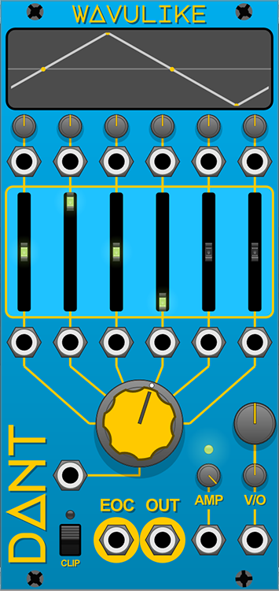
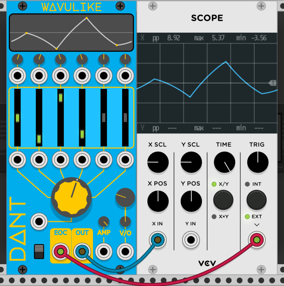
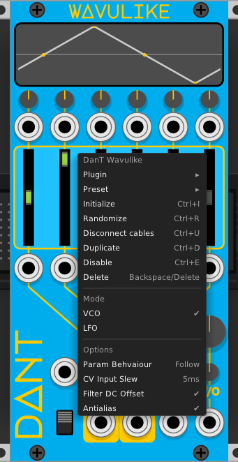
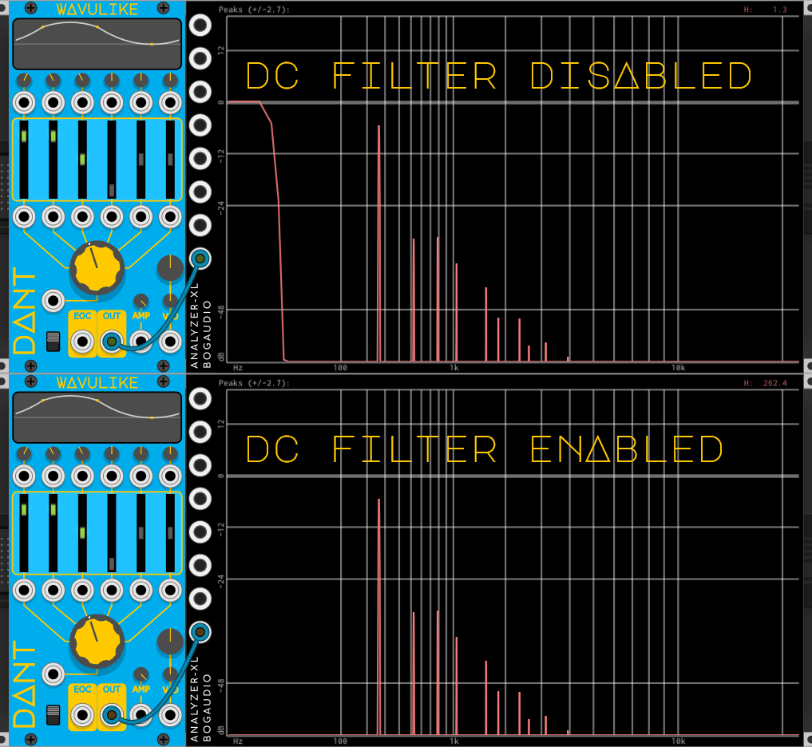

# WAVULIKE

* [Overview](#overview)
* [Basic Operation](#basic-operation)
* [Q Control](#q-control)
* [Single Point Mode](#single-point-mode)
* [Output Clipping](#output-clipping)
* [End Of Cycle](#end-of-cycle)
* [LFO Mode](#lfo-mode)
* [Module Options](#module-options)
* [Module Design & Audio Quality](#module-design--audio-quality)
* [Polyphony](#polyphony)

## Overview

**12hp**

WAVULIKE is an oscillator that is based on a waveform generated by `1` to `6` control points (labeled `A` to `F`).

The components of the module are (top to bottom, left to right):

* Waveform Visualization Screen
* Q control knobs A to F
* Q control inputs A to F
* Point control sliders A to F
* Point control inputs A to F
* Active points selector knob
* Frequency knob
* Active points input
* Output amplitude knob
* Fine tune knob
* Output clipping switch
* End of Cycle output
* Waveform output
* Amplitude input
* Volt per octave input

## Basic Operation

In the initialized state, the module has `4` active points, `A = 0`, `B = 1`, `C = 0`, `D = -1` and their Q controls are all set to `0`.

As you can see in the Visualization Screen, this generates a triangle waveform, which is output at the default pitch of `C4` at full Amplitude of `+-5` volts.

The Sliders in the centre control the value of the associated point, ranging from `-1` to `1`.

The small Knobs above the Sliders control the Q value for the point, see [Q Control](#q-control).

The large centre Knob controls the number of Active Points.

All the inputs allow CV control of the associated parameter.

The Amplitude control can be used as a built in VCA. The Amplitude value ranges from `-100%` to `+100%`, so this control can be used to invert the output waveform.

## Q Control

Each active control point has an associated Q control knob and input.

The Q control dictates the path of the waveform to the right of the active control point.

At `0` this is linear. Positive or negative values create quadratic [Bézier curves](https://en.wikipedia.org/wiki/B%C3%A9zier_curve).

For example, you can approximate a sine wave with `4` Active Points and Q control values of `1` & `-1`.

## Single Point Mode [Demo Video](https://www.instagram.com/p/CIarR7UByN5/)

When only point A is active the Frequency, Fine Tune and Q control have no effect.

The Output is a static voltage based on the value of the point A slider multiplied by the Amplitude control.

However, it is still possible to create a waveform output by modulating the value of point A.

## Output Clipping [Demo Video](https://www.instagram.com/p/CIaw1IxBDIG/)

Each control point value is clamped to `+-1` volt. The Amplitude control scales the output to `+-5` volts at `100%`, which is typical for audio signals in Eurorack.

However, the Q control can cause the waveform to exceed these values.

The Clip Output switch controls the behavior of the Amplitude control when the waveform exceeds `+-5` volts.

When Clip Output is active, the output is limited to `+-5` volts, when inactive the output may exceed `+-5` volts.

## End Of Cycle

The EOC output sends a `+10` volt trigger at the end of every waveform cycle.

The cycle length is determined by the sample rate and the frequency.

This output can be used to sync other modules to the output waveform. For example, this can be used as an external trigger for the VCV Scope module to prevent the waveform display from phasing.

## LFO Mode [Demo Video](https://www.instagram.com/p/CItOmdmB-k3/)

This module has two modes of operation:
* **VCO Mode**
  * Standard mode, outputs a generated waveform at the frequency specified by the Frequency knob and the Volt per Octave input
* **LFO Mode**
  * Exactly the same as VCO Mode, except the output frequency is reduced by a factor of `100`

The current module mode can be seen and changed in the context menu (right click on the module to access the context menu).

## Module Options

The module has a number of options that alter the behavior of the controls or the character of the audio output.

The context menu can be accessed by right-clicking on the module panel.

The options are as follows:

* **Param Behaviour** [Demo Video](https://www.instagram.com/p/CI--C8GBP6E/)
  * Value `Follow`: The Knobs and Sliders for the Points values, Q controls & Active Points will follow the CV input if a cable is connected.
  * Value `Offset`: The knobs and sliders remain freely movable, if a CV input is connected, its value will be offset from the knob or slider position
* **CV Input Slew** [Demo Video](https://www.instagram.com/p/CI-7aH1BKd7/)
  * This option changes the length of the built-in slew for the CV inputs. Clicking it will cycle through the available values of `None`, `1 millisecond`, `5 milliseconds`, `10 milliseconds`, `25 milliseconds`, `50 milliseconds` & `100 milliseconds`
* **Filter DC Offset** [Demo Video](https://www.instagram.com/p/CI_BMAEhOmv/)
  * This option activates & deactivates the high pass filter that compensates for DC Offset in the output
* **Antialias** [Demo Video](https://www.instagram.com/p/CI_EGeaBQ4c/)
  * This option activates & deactivates the Anti-aliasing option that is designed to reduce aliasing at high frequencies

## Module Design & Audio Quality

This module is designed to allow you to create custom waveforms and modulate the parameters of that waveform. Hopefully this makes it a flexible sound source, but with that flexibility there are also pitfalls. There are currently 3 areas of audio quality concern:
* **Clicks** in the output audio
  * This module has built-in slew limiters on the Point control and Q control inputs. These are designed to smooth out abrupt changes in the input CV, and therefore avoid audible clicks in the output
  * The length of the slew can be adjusted in the context menu options, this allows the slew to be tailored to the operating frequency of the module, ie. a longer slew may work better when LFO mode is active
  * This type of slew does not apply to the Active Points input or manual modulation of the Active Point knob. Depending on the settings of the Points and the Q controls, changing the number of Active Points can cause audible clicks.
  * You could address this issue by making use of the Amplitude control; Input an envelope, or duck the amplitude to `0%` on the change to remove the click in the output. Notice in this [Demo Video](https://www.instagram.com/p/CIjdLrUB2WS/) how there are no clicks in the audio, and how the Amplitude control has an envelope sent to its CV input in between the CV changes to the Active Points input.
* **DC Offset** of the waveform
  * DC Offset occurs when the waveform you generate is not balanced around the `0` point, or in single point mode when the output is not `0`. When there is DC Offset in the output there will be a frequency "hump" from `0Hz` to `~15Hz`, and this can in some situations cause unwanted audio artifacts.
  * This module has a built-in high pass filter at `15Hz`, to remove the frequency hump. You may notice the effect of this filter as a shifting of the waveform center point when viewing it on an oscilloscope. If this is undesirable, the filter can be deactivated in the context menu options
  * 
* Digital **Aliasing**
  * See this excellent [document](https://github.com/squinkylabs/SquinkyVCV/blob/main/docs/aliasing.md) from [Squinky Labs](https://www.facebook.com/SquinkyLabs) on aliasing.
  * This module has a built-in Anti-aliasing feature that is designed to remove high frequencies from the audio output that are a result of digital aliasing.
  * This feature is implemented as `8x` oversampling with a `10kHz` low pass filter.
  * When active you may notice a slight reduction in top-end frequencies, if this is undesirable, the Anti-aliasing can be deactivated in the context menu options.
  * 

## Polyphony

This module is not currently compatible with VCV Rack's Polyphonic cables. If you would like polyphonic support, you can let me know via an [issue](https://github.com/Miff-Real/DanTModules-Manual/issues), via the [VCV Rack Community](https://community.vcvrack.com/t/dantmodules-v1-0-2-update-context-menu-options-for-wavulike-bug-fix-v1-0-3/11885), or via my [Instagram](https://www.instagram.com/dant.synth/).
